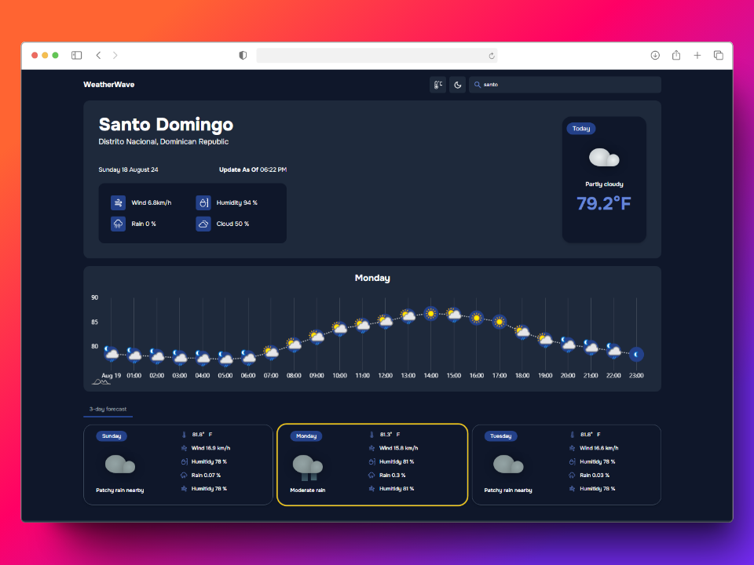

**WeatherWave**

## 🚪 Description

**WeatherWave** is a stunning and intuitive website that allows users to check the weather in their location and around the world. With a sleek interface and real-time updates, WeatherWave provides essential weather information, including temperature, wind speed, humidity, and cloud coverage. The application features hourly and daily forecasts, giving users a comprehensive view of upcoming weather conditions.

## Features

⏲️ **Real-Time Weather Data**: Get up-to-the-minute weather updates for any location.
⛅ **Hourly Forecast**: Detailed hourly breakdown of weather conditions.
🌏 **Global Coverage**: Check the weather anywhere in the world.
✨ **User-Friendly Interface**: Designed for simplicity and ease of use.

## Visuals

Here is a preview of WeatherWave's main interface, showcasing the current weather conditions in Santo Domingo, Dominican Republic.


## Installation

To set up WeatherWave locally on your machine, follow these steps:

1. **clone the repo**:
```sh
   git clone https://github.com/JeanCornelio/WeatherWave
```
2. **navigate to the project directory**:
```sh
   cd WeatherWave
```
3. **Install dependencies**:
```sh
   npm install
```
4. **Start the app**:
```sh
   npm run dev
```

## Usage

**Search for a city**: Enter the name of a city in the search bar to see the current weather conditions and forecast.

**View detailed forecast**: Click on the hourly forecast to see more detailed information for the day.

## Contributing

1. **Fork the repo**:
2. **Create new branch**:
```sh
   git checkout -b feature-name
```
3. **Make your changes and commit them**:
```sh
  git commit -m "Add feature"
```
4. **Push to the branch**:
```sh
  git push origin feature-name
```

